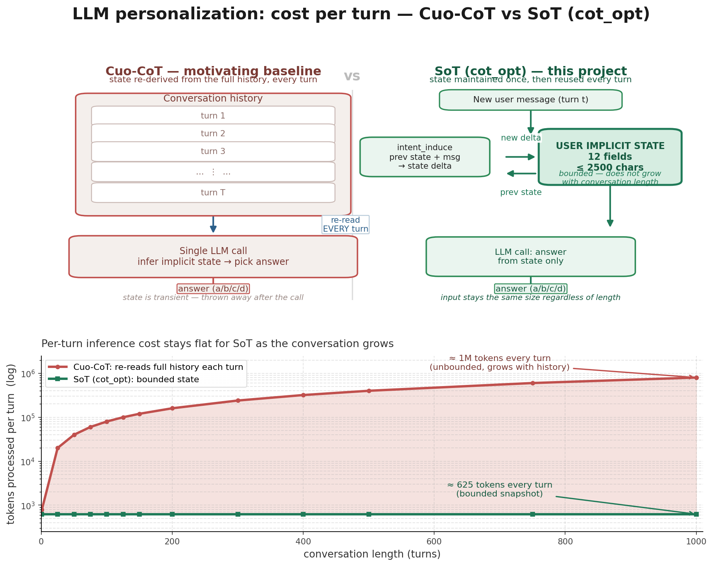

# LLM Personalization Enhancement: `SoT(Step of Thought)(cot_opt)`



Two techniques for improving LLM response personalization, evaluated on the
[PersonaMem-v1](https://huggingface.co/datasets/bowen-upenn/PersonaMem-v1) and
[PersonaMem-v2](https://huggingface.co/datasets/bowen-upenn/PersonaMem-v2) benchmarks
(selectable via `--benchmark v1|v2`).

## Techniques

**`SoT(cot_opt)`** — *incremental state maintenance.* Based on *Cuo-CoT*,instead of re-deriving the user's
implicit state from the entire history on every new query (which re-reads up to 1M tokens
each time), the state is **maintained across turns**: each user message updates the state
through a cheap `intent_induce` step, and the final query is answered directly from the
current state. At serving time this avoids re-reading the whole history on every turn.

On the offline benchmark, `cot_opt` is evaluated faithfully by walking the history once per
context, caching the intermediate states, and answering each question from the state at its
cut-off point. The state can be refreshed less often than every turn with `--update-every N`:
the update fires on the 1st, (N+1)-th, (2N+1)-th, … user turn, and the answer call then
injects the dialogue turns since the last update as short-term memory — cutting the number
of `intent_induce` calls (and hence latency) roughly N-fold while the state stays a bounded,
approximate snapshot. `--update-every 1` (the default) is the original every-turn behavior.

## Repository layout

```
.
├── prompt/                       # LLM prompts (markdown templates)
│   ├── cot.md / cot_sys.md             # cot: reason state, then select
│   ├── cot_opt.md / cot_opt_sys.md     # cot_opt: select from a maintained state
│   └── intent_induce.md / intent_induce_sys.md  # cot_opt: fold new info into the state
├── benchmark/
│   ├── personaMem.py             # PersonaMemV1 evaluation harness (v1 and v2)
│   ├── questions_*.csv           # v1 benchmark questions (32k / 128k / 1M)
│   ├── shared_contexts_*.jsonl   # v1 shared multi-turn conversation histories
│   └── v2/                       # v2 data converted into the same on-disk layout
├── utils.py                      # constants + generic helpers
├── prompts.py                    # prompt loading / rendering / input formatting
├── state.py                      # implicit-state schema, parse & format
├── parsing.py                    # answer extraction (a/b/c/d)
├── data.py                       # benchmark data loading & slicing
├── backend.py                    # inference backends: stub / hf / api
├── main.py                       # CLI entry point
├── data_download.py              # download benchmark files from Hugging Face
└── tests/                        # unit + integration tests (no model inference)
```

## Quick start

```bash
# 0. Optional: fetch the benchmark data into benchmark/
python data_download.py --size 32k                 # PersonaMem-v1
python data_download.py --benchmark v2 --size 32k  # PersonaMem-v2 (downloaded + converted)

# 1. Dry run with a deterministic stub backend (no model, validates the plumbing)
python main.py --method cot_opt --backend stub --limit 5 --verbose
python main.py --benchmark v2 --method cot --backend stub --limit 5 --verbose

# 2. Real evaluation with a local transformers model
#    (use the instruction-tuned gemma-4 variant, which is what the model card
#    recommends for chat; the base model also works via the manual template)
python main.py --method cot --backend hf --model google/gemma-4-E4B-it --size 32k --output results.csv

# 3. Real evaluation through an OpenAI-compatible endpoint
LLM_API_KEY=... LLM_API_BASE_URL=... \
    python main.py --method cot_opt --backend api --model gemma-4-E4B --output results.csv

# 4. Run the test suite (pure Python, no model, no network)
python -m unittest discover -s tests -v
```

### CLI options

| Flag | Meaning |
| --- | --- |
| `--method cot\|cot_opt` | which solution to evaluate |
| `--benchmark v1\|v2` | which benchmark to evaluate (default `v1`; v2 sizes: `32k`/`128k`) |
| `--size 32k\|128k\|1M` | benchmark context size |
| `--backend hf\|api\|stub` | inference backend |
| `--model NAME` | model id (default `google/gemma-4-E4B`) |
| `--limit N` | evaluate only the first N questions |
| `--seed-persona` | `cot_opt` only (ablation): fold the persona system messages into the state |
| `--no-cache` | `cot_opt` only: re-walk the state for every question |
| `--batch None\|4\|8` | `hf` backend: samples per `generate()` call. `None`/`1` = sequential single-inference (default, exact per-sample behavior); `4`/`8` = batch that many independent samples per call |
| `--output PATH` | write per-question results as CSV (includes the raw `model_response`) |
| `--api-base-url`, `--api-key`, `--api-model` | settings for the `api` backend |
| `--max-new-tokens N` | generation limit |
| `--great-exp-max N` | `cot_opt` only: character budget for the `Great_experience` field (default `1500`). When an update would grow it past this, one extra LLM call condenses it (fact-preserving) instead of truncating it. Lower it on a smaller GPU. |
| `--update-every N` | `cot_opt` only: recompute the user's implicit state every N user turns instead of every turn (default `1` = every turn). Larger N cuts the state-update LLM calls ~N-fold; the turns since the last update are then injected into the answer call as short-term memory. |
| `--verbose` | per-question inference log: every model call's raw output (see below) |

### Verbose inference log (`--verbose`)

`--verbose` prints, for **each question**, every model inference call made for it —
a header, the query, the model's **raw output**, the extracted/expected letters,
and (for `cot_opt`) each `intent_induce` state update with the state delta:

```
=====================================================================
Question 1/2  qid=...  type=recall_user_shared_facts  end_index=182
=====================================================================
[state:intent_induce] new_information="User message:\nHi there! I've ..." [truncated, 583 chars]
  raw output: **name**: unknown
**age**: unknown
...
  state delta: interest: 'unknown' -> 'music and technology'
[answer:cot_opt] query="I recently attended an event ..."  options=4
  raw output: (a)
  extracted: 'a'   expected: 'c'
```

The same raw output is stored per question in the `--output` CSV's `model_response`
column for later inspection.

### Batched inference (`--batch`)

The default (`--batch None`, equivalent to `1`) is the sequential single-inference
path: one `generate()` call per sample, which reproduces the original per-sample
behavior exactly. `--batch 4` / `--batch 8` groups independent samples into one
batched `generate()` call (through `backend.complete_batch`) to exploit GPU
headroom:

- **`cot`** — the answer-selection calls across questions are independent, so they
  are batched directly.
- **`cot_opt`** — the answer-selection calls are batched, and so are the
  `intent_induce` state updates, but **across different contexts in lockstep**:
  updates *within* one context stay sequential (each update depends on the
  previous state), while the update for turn *t* of every context runs in one
  batched call. The per-context cache is reused exactly as in the sequential path.

Batching does **not** change per-sample semantics: each row's attention is masked
to its own tokens, so samples never interfere with each other, and the computed
implicit states are identical to the sequential walk. The only difference is
floating-point — a different batch shape changes the GEMM accumulation order, and
greedy argmax can flip a token only when the logits are near-tied. In practice the
outputs are identical for confident generations; on very small models a handful of
near-tie answers may flip. For bit-exact reproducibility, run the whole evaluation
through one mode (all `--batch None`, or all `--batch N`) rather than mixing them.

## Implicit state

The user's implicit state is a 12-field structured representation (defined in
`log.md` and mirrored by `STATE_FIELDS` in `state.py`):

`name, age, gender, location, preference, occupation, interest, emotion, objective,
knowledge, Great_experience, character`

Values are meant to be concrete and vivid (e.g. *"a little excited, but also a little shy"*)
and default to `unknown` when they cannot be inferred.

Every field is maintained as the user's *current* state: the `intent_induce` prompt has the
model decide, **per field**, whether the new information actually changes it, and output one
of three things — its updated current value (changed, new value determinable), `unknown`
(changed, but the new value cannot be determined — the old value no longer holds), or
`unchanged` (no evidence the field changed; the previous value is kept). `merge_state`
resolves `unchanged` back to the previous value and applies everything else, so a field is
never rewritten without evidence of change, and a genuine change to an unknown value is not
suppressed. `state.py` also enforces two hard bounds so the state stays small no matter how
the model behaves: `MAX_FIELD_LEN` caps any single field, and `MAX_STATE_LEN` caps the total
across all fields (both keep the most recent text, trimming from the tail). This keeps the
state — and therefore the prompt/KV cache — bounded regardless of conversation length.

**`Great_experience` is the one exception:** significant past experiences legitimately
*accumulate*, so it has its own budget (`--great-exp-max`, default `1500` chars). When an
update would grow it past the budget, one extra LLM call condenses the whole field
(fact-preserving: names, places, dates, events, achievements, skills, milestones are kept;
redundancy is dropped) instead of silently truncating the tail. Parsing hard-caps the field
at `min(MAX_STATE_LEN, 2 * great_exp_max)` so a single runaway output stays bounded, and
`MAX_STATE_LEN` trims `Great_experience` last. The condensation calls are logged as
`[state:great_exp_summarize]` and fire identically in the sequential and batched walks.

**Memory budget.** The batched `cot_opt` walk groups one row per context (≤ 37 on the 32k
split). gemma-4-E4B's KV cache is ≈ 86 KB/token/sequence (42 layers × 2 kv-heads × 256
head-dim × bf16). With the total state ≤ 2500 chars (≈ 625 tokens), the worst-case walk call
is ≈ 8.7 GB of KV, so a full run sits around 24–26 GB — comfortably inside a 40 GB GPU
(`--great-exp-max 1500`).

## Design notes (deviations from the initial draft)

The initial draft's design is sound; the implementation below fixes several correctness
and robustness issues:

1. **Fields hold the current state, not a growing log.** The original `intent_induce`
   prompt said *"Do not keep the user's previous state as the current state"*, which invites
   the model to *drop* stable facts (name, age, long-standing preferences) on every update —
   the exact failure mode an incremental-state method must avoid. Fixing that drift the other
   way is just as wrong: telling the model to *update evolving fields* makes it accumulate
   every past value into each field (`*now …*` chains), so every field grows with every turn
   and the KV cache grows with it. The prompt now says each field is the user's **current**
   state — a field that changes is rewritten (not appended), and facts that remain valid are
   carried forward unchanged. `state.MAX_FIELD_LEN` (per field) and `state.MAX_STATE_LEN`
   (total across all fields) are hard backstops so the state stays bounded even if a model
   drifts back to accumulating. `Great_experience` is the deliberate exception — it is the
   one field meant to accumulate — so it gets its own budget (`--great-exp-max`) and, on
   overflow, a dedicated LLM condensation call rather than a tail-truncation.

2. **No persona leakage.** The dataset's `system` messages are the ground-truth user
   profile (e.g. *"Current user persona: Name: Kanoa Manu — a 32-year-old software
   engineer…"*). Feeding them to the model would let it answer the benchmark questions
   without actually reasoning about the user's implicit state. **Both** methods therefore
   evaluate on dialogue-only histories: `cot` renders `User`/`Assistant` turns only, and
   `cot_opt` updates its state from user turns only. The persona blocks can be included
   purely as an ablation via `--seed-persona`.

3. **State-walk caching.** Questions in PersonaMem share `shared_context_id` and differ
   only by `end_index`. The walk is therefore done once per context and checkpointed at
   every message index, so all questions reusing a context share the same inference
   (~2.5× fewer state-update calls on the 32k split, ~40× on 1M). Use a deterministic
   backend (temperature 0) for exactly reproducible results.

4. **Prompt templates.** `cot.md`'s output-format example used `{user_name}`-style
   placeholders that collide with template rendering; replaced with concrete example
   values. Fixed the `**Great_experience**"` typo. `cot_opt`/`cot` output-format examples
   now show a concrete `(c)` identifier.

5. **Backends.** Model inference is abstracted behind `backend.LLMBackend`:
   - `stub` — deterministic responses for tests and dry runs (no model, no network);
   - `hf` — local `transformers` inference, lazily imported;
   - `api` — any OpenAI-compatible endpoint.
   The original code imported a `transformers` model at module import time and used a
   non-standard loader/API; that is fixed and isolated.

   The `hf` backend also handles tokenizers with **no `chat_template`**. The Gemma-4
   family is one such case: the base `google/gemma-4-E4B` tokenizer has no
   `chat_template`, so `apply_chat_template` raises `ValueError`. When the tokenizer
   has no template, the backend builds the prompt manually in the canonical Gemma-4
   format (`<|turn>…<turn|>` turns, `<|think|>` thinking gate, empty
   `<|channel>thought\n<channel|>` block on the generation prompt), and falls back to
   Gemma-2/3, ChatML, or a plain labeled format for other template-less models.
   `tests/test_backend.py` pins the exact rendered prompts. Note that the
   instruction-tuned **`google/gemma-4-E4B-it`** ships the official template and is
   what the model card recommends for chat; prefer it over the base model for this
   evaluation.

6. **Answer extraction** is robust to the two output formats (state + identifier for
   `cot`; bare identifier for `cot_opt`) and to free-form model output.

## Testing without expensive model runs

The test suite in `tests/` is pure Python — it exercises prompt rendering, state/answer
parsing, data loading, and full end-to-end runs with the `stub` backend (verifying the
state-walk ordering and the cache behavior via backend call counts). No model is loaded and
no network is used:

```bash
python -m unittest discover -s tests -v
```

# Acknowledgements

- *Hongru Wang* (2023). **Cue-CoT: Chain-of-thought Prompting for Responding to In-depth Dialogue Questions with LLMs**. 
[](https://arxiv.org/abs/2305.11792)
- *Bowen Jiang* (2025). **Know Me, Respond to Me: Benchmarking LLMs for Dynamic User Profiling and Personalized Responses at Scale**. [](https://arxiv.org/abs/2504.14225)
- *Bowen Jiang* (2025). **PERSONAMEM-V2: Towards Personalized Intelligence via Learning Implicit User Personas and Agentic Memory**. [](https://arxiv.org/pdf/2512.06688)
